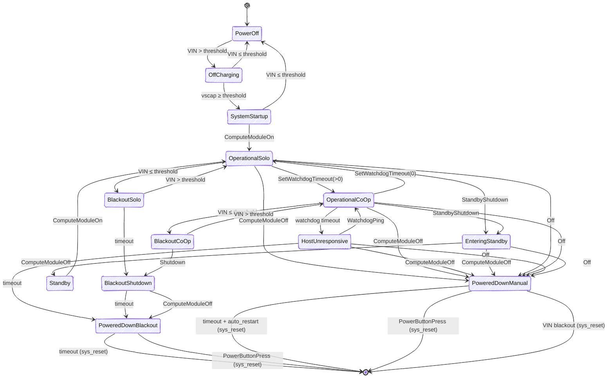

# HALPI2 (Hat Labs Raspberry Pi Computer 2) Firmware

## Introduction

[HALPI2](https://shop.hatlabs.fi/products/halpi2-computer) is a Boat Computer based on the Raspberry Pi Compute Module 5 (CM5),
designed and manufactured by Hat Labs. Among other things, it features a
RP2040 microcontroller ("Controller") that handles the power management, communication with the
Raspberry Pi, and the control of the peripherals. The firmware for the RP2040 is
written in Rust.

## Implementation

The firmware is implemented using Rust and the Embassy framework.

## GPIO Description

The controller GPIO pins are documented below.

| GPIO # | Name        | Description                                                    |
| ------ | ----------- | -------------------------------------------------------------- |
| 0      | RGBLED      | Data output for the five SK6805 (WS2812 style) RGB LEDs.       |
| 1      | PCIe_LED    | PCIe LED indicator. Active low.                                |
| 2      | PWR_BTN_IN  | Input from the physical power button. Active low.              |
| 3      | USER_BTN    | Input from the user-defined button. Active low.                |
| 4      | PCIESLEEP   | Pull high to put the PCIe device to sleep.                     |
| 5      | GPIO05      | Connected to the GPIO header. Not used.                        |
| 6      | GPIO06      | Connected to the GPIO header. Not used.                        |
| 7      | GPIO07      | Connected to the GPIO header. Not used.                        |
| 8      | GPIO08      | Connected to the GPIO header. Not used.                        |
| 9      | PWR_BTN_OUT | Output to the CM5 power button pin. Active low.                |
| 10     | LED_PWR     | Power LED state from CM5. Active low.                          |
| 11     | LED_ACTIVE  | Active LED state from CM5. Active low.                         |
| 12     | N/C         | Not connected.                                                 |
| 13     | CM_ON       | 3.3V output of the CM5. Used to detect the CM power state.     |
| 14     | I2C1_SDA    | I2C1 data line. CM5 is primary, the controller is secondary.   |
| 15     | I2C1_SCL    | I2C1 clock line. CM5 is primary, the controller is secondary.  |
| 16     | TEST_MODE   | Input to enable test mode. Pull-high, active low.              |
| 17     | GPIO17      | Connected to the test pad. Not used.                           |
| 18     | PG_5V       | Power Good input from the 5V buck converter. Active high.      |
| 19     | VEN         | Voltage Enable output for the 5V buck converter. Active high.  |
| 20     | I2Cm_SDA    | I2Cm data line. Controller is primary.                         |
| 21     | I2Cm_SCL    | I2Cm clock line. Controller is primary.                        |
| 22     | DIS_USB3    | USB3 disable signal. Active high.                              |
| 23     | DIS_USB2    | USB2 disable signal. Active high.                              |
| 24     | DIS_USB1    | USB1 disable signal. Active high.                              |
| 25     | DIS_USB0    | USB0 disable signal. Active high.                              |
| 26     | VinS        | Analog: Scaled input voltage level.                            |
| 27     | VscapS      | Analog: Scaled supercap voltage level.                         |
| 28     | Iin         | Analog: Input current level.                                   |
| 29     | GPIO29_ADC3 | Analog: ADC channel 3 input. Unused.                           |

## State Machine

The controller implements a hierarchical state machine to manage the power states of the system. The transition
diagram is shown below:

## RGB LEDs

HALPI2 has a bar of five RGB LEDs that can be controlled by the controller. The
LEDs indicate the supercap voltage level and the power state of the system.

The LEDs act as a bar graph, with the first LED indicating a voltage level between
5.0V and 6.0V, and the last LED indicating a voltage level between 9.0V and 10.0V.

When the system is powered off, the bar is red. When the system is booting but not
yet communicating with the controller, the bar is yellow. When the system is
powered on, the bar is green. When the system is shutting down, the bar is purple.

A depleting state is indicated by an animation scrolling right to left.
An overvoltage state is indicated by rapid flashing of the first LED.

## I2C Communication

The controller communicates with the CM5 over I2C. The CM5 is the primary device
on the I2C bus, and the controller is the secondary device. The controller
responds to I2C requests using bus address 0x6d. The list of commands is given below:

| R/W   | Command | R/W Type | Value         | Description                                             |
| ----- | ------- | -------- | ------------- | ------------------------------------------------------- |
| Read  | 0x01    | u8       | 0xff          | Query legacy hardware version                           |
| Read  | 0x02    | u8       | 0xff          | Query legacy firmware version                           |
| Read  | 0x03    | u32      |               | Query hardware version                                  |
| Read  | 0x04    | u32      |               | Query firmware version                                  |
| Read  | 0x10    | u8       |               | Query Raspi power state (0=off, 1=on)                   |
| Write | 0x10    | u8       | 0x00          | Set Raspi power off                                     |
| Write | 0x10    | u8       | 0x01          | Set Raspi power on (who'd ever send that?) |
| Read  | 0x12    | u16      |               | Query watchdog timeout (ms)                             |
| Write | 0x12    | u16      |               | Set watchdog timeout to NNNN ms (u16, big-endian)       |
| Write | 0x12    | u16      | 0x0000        | Disable watchdog                                        |
| Read  | 0x13    | u16      |               | Query power-on supercap threshold voltage (centivolts)  |
| Write | 0x13    | u16      |               | Set power-on supercap threshold to 0.01*NNNN V          |
| Read  | 0x14    | u16      |               | Query power-off supercap threshold voltage (centivolts) |
| Write | 0x14    | u16      |               | Set power-off supercap threshold to 0.01*NNNN V         |
| Read  | 0x15    | u8       |               | Query state machine state (placeholder)                 |
| Read  | 0x16    | u8       |               | Query watchdog elapsed (always returns 0x00)            |
| Read  | 0x17    | u8       |               | Query LED brightness setting                            |
| Write | 0x17    | u8       |               | Set LED brightness to NN                                |
| Read  | 0x20    | u16      |               | Query DC IN voltage                                     |
| Read  | 0x21    | u16      |               | Query supercap voltage                                  |
| Read  | 0x22    | u16      |               | Query DC IN current                                     |
| Read  | 0x23    | u16      |               | Query MCU temperature                                   |
| Write | 0x30    | u8       |               | Initiate shutdown                                       |
| Write | 0x31    | u8       |               | Initiate sleep shutdown                                 |
| Write | 0x40    | u32      |               | Start DFU, firmware size is NNNNNNNN bytes              |
| Read  | 0x41    | u8       |               | Read DFU status (see DFUState enum)                     |
| Read  | 0x42    | u16      |               | Read number of DFU blocks written                       |
| Write | 0x43    | [var]    |               | Upload a block of DFU data (CRC32, blocknum, len, data) |
| Write | 0x44    |          |               | Commit the uploaded DFU data                            |
| Write | 0x45    |          |               | Abort the DFU process                                   |
