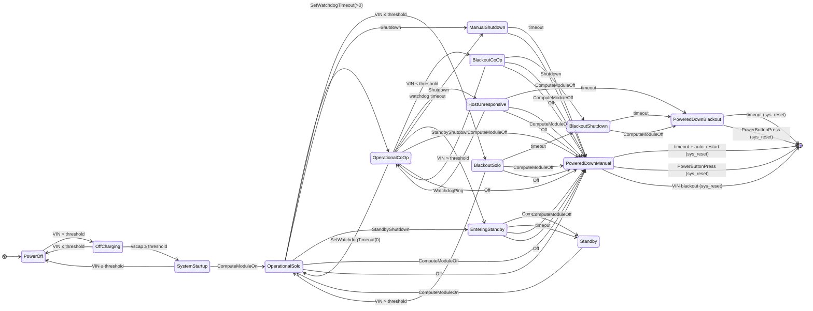

# HALPI2 (Hat Labs Raspberry Pi Computer 2) Firmware

## Introduction

[HALPI2](https://shop.hatlabs.fi/products/halpi2-computer) is a Boat Computer based on the Raspberry Pi Compute Module 5 (CM5),
designed and manufactured by Hat Labs. Among other things, it features a
RP2040 microcontroller ("Controller") that handles the power management, communication with the
Raspberry Pi, and the control of the peripherals. The firmware for the RP2040 is
written in Rust.

## Implementation

The firmware is implemented using Rust and the Embassy framework.

## GPIO Description

The controller GPIO pins are documented below.

| GPIO # | Name        | Description                                                    |
| ------ | ----------- | -------------------------------------------------------------- |
| 0      | RGBLED      | Data output for the five SK6805 (WS2812 style) RGB LEDs.       |
| 1      | PCIe_LED    | PCIe LED indicator. Active low.                                |
| 2      | PWR_BTN_IN  | Input from the physical power button. Active low.              |
| 3      | USER_BTN    | Input from the user-defined button. Active low.                |
| 4      | PCIESLEEP   | Pull high to put the PCIe device to sleep.                     |
| 5      | GPIO05      | Connected to the GPIO header. Not used.                        |
| 6      | GPIO06      | Connected to the GPIO header. Not used.                        |
| 7      | GPIO07      | Connected to the GPIO header. Not used.                        |
| 8      | GPIO08      | Connected to the GPIO header. Not used.                        |
| 9      | PWR_BTN_OUT | Output to the CM5 power button pin. Active low.                |
| 10     | LED_PWR     | Power LED state from CM5. Active low.                          |
| 11     | LED_ACTIVE  | Active LED state from CM5. Active low.                         |
| 12     | N/C         | Not connected.                                                 |
| 13     | CM_ON       | 3.3V output of the CM5. Used to detect the CM power state.     |
| 14     | I2C1_SDA    | I2C1 data line. CM5 is primary, the controller is secondary.   |
| 15     | I2C1_SCL    | I2C1 clock line. CM5 is primary, the controller is secondary.  |
| 16     | TEST_MODE   | Input to enable test mode. Pull-high, active low.              |
| 17     | GPIO17      | Connected to the test pad. Not used.                           |
| 18     | PG_5V       | Power Good input from the 5V buck converter. Active high.      |
| 19     | VEN         | Voltage Enable output for the 5V buck converter. Active high.  |
| 20     | I2Cm_SDA    | I2Cm data line. Controller is primary.                         |
| 21     | I2Cm_SCL    | I2Cm clock line. Controller is primary.                        |
| 22     | DIS_USB3    | USB3 disable signal. Active high.                              |
| 23     | DIS_USB2    | USB2 disable signal. Active high.                              |
| 24     | DIS_USB1    | USB1 disable signal. Active high.                              |
| 25     | DIS_USB0    | USB0 disable signal. Active high.                              |
| 26     | VinS        | Analog: Scaled input voltage level.                            |
| 27     | VscapS      | Analog: Scaled supercap voltage level.                         |
| 28     | Iin         | Analog: Input current level.                                   |
| 29     | GPIO29_ADC3 | Analog: ADC channel 3 input. Unused.                           |


## State Machine

The controller implements a hierarchical state machine to manage the power states of the system. The transition
diagram is shown below. Super-states are not shown, only the transitions between the concrete states.



## RGB LEDs

HALPI2 has a bar of five RGB LEDs that can be controlled by the controller. The
LEDs indicate the supercap voltage level and the power state of the system.

The LEDs act as a bar graph, with the first LED indicating a voltage level between
5.0V and 6.0V, and the last LED indicating a voltage level between 9.0V and 10.0V.

When the system is powered off, the bar is red. When the system is booting but not
yet communicating with the controller, the bar is yellow. When the system is
powered on, the bar is green. When the system is shutting down, the bar is purple.

A depleting state is indicated by an animation scrolling right to left.
An overvoltage state is indicated by rapid flashing of the first LED.


## I2C Communication

The controller communicates with the CM5 over I2C. The CM5 is the primary device
on the I2C bus, and the controller is the secondary device. The controller
responds to I2C requests using bus address 0x6d. The list of commands is given below:

| R/W   | Command | R/W Type | Value         | Description                                             |
| ----- | ------- | -------- | ------------- | ------------------------------------------------------- |
| Read  | 0x01    | u8       | 0x00          | Query legacy hardware version                           |
| Read  | 0x02    | u8       | 0xff          | Query legacy firmware version                           |
| Read  | 0x03    | u32      |               | Query hardware version (4 bytes)                       |
| Read  | 0x04    | u32      |               | Query firmware version (4 bytes)                       |
| Read  | 0x10    | u8       |               | Query Raspi power state (0=off, 1=on)                  |
| Write | 0x10    | u8       | 0x00          | Set Raspi power off                                     |
| Read  | 0x12    | u16      |               | Query watchdog timeout (ms, big-endian)                |
| Write | 0x12    | u16      |               | Set watchdog timeout to NNNN ms (u16, big-endian)      |
| Write | 0x12    | u16      | 0x0000        | Disable watchdog                                        |
| Read  | 0x13    | u16      |               | Query power-on supercap threshold voltage (centivolts) |
| Write | 0x13    | u16      |               | Set power-on supercap threshold to 0.01*NNNN V         |
| Read  | 0x14    | u16      |               | Query power-off supercap threshold voltage (centivolts)|
| Write | 0x14    | u16      |               | Set power-off supercap threshold to 0.01*NNNN V        |
| Read  | 0x15    | u8       |               | Query state machine state                               |
| Read  | 0x16    | u8       | 0x00          | Query watchdog elapsed (always returns 0x00)           |
| Read  | 0x17    | u8       |               | Query LED brightness setting                            |
| Write | 0x17    | u8       |               | Set LED brightness to NN                                |
| Read  | 0x18    | u8       |               | Query auto restart setting (0=disabled, 1=enabled)     |
| Write | 0x18    | u8       |               | Set auto restart to NN (0=disabled, 1=enabled)         |
| Read  | 0x19    | u32      |               | Query solo depleting timeout (ms, big-endian)          |
| Write | 0x19    | u32      |               | Set solo depleting timeout to NNNNNNNN ms (big-endian) |
| Read  | 0x20    | u16      |               | Query DC IN voltage (scaled u16)                       |
| Read  | 0x21    | u16      |               | Query supercap voltage (scaled u16)                    |
| Read  | 0x22    | u16      |               | Query DC IN current (scaled u16)                       |
| Read  | 0x23    | u16      |               | Query MCU temperature (scaled u16)                     |
| Read  | 0x24    | u16      |               | Query PCB temperature (scaled u16)                     |
| Write | 0x30    | any      |               | Initiate shutdown                                       |
| Write | 0x31    | any      |               | Initiate sleep shutdown                                 |
| Write | 0x40    | u32      |               | Start DFU, firmware size is NNNNNNNN bytes (big-endian)|
| Read  | 0x41    | u8       |               | Read DFU status (see DFUState enum)                    |
| Read  | 0x42    | u16      |               | Read number of DFU blocks written (big-endian)         |
| Write | 0x43    | [var]    |               | Upload DFU block (CRC32, blocknum, len, data)          |
| Write | 0x44    | any      |               | Commit the uploaded DFU data                           |
| Write | 0x45    | any      |               | Abort the DFU process                                   |
| Read  | 0x50    | f32      |               | Query VIN correction scale (big-endian)                |
| Write | 0x50    | f32      |               | Set VIN correction scale (big-endian)                  |
| Read  | 0x51    | f32      |               | Query VSCAP correction scale (big-endian)              |
| Write | 0x51    | f32      |               | Set VSCAP correction scale (big-endian)                |
| Read  | 0x52    | f32      |               | Query IIN correction scale (big-endian)                |
| Write | 0x52    | f32      |               | Set IIN correction scale (big-endian)                  |

## Development

### Hardware Requirements

For native flashing and debug log viewing, you need a **Raspberry Pi Debug Probe** connected to the debug header next to the RP2040 MCU. The header has three pins labeled:
- **SWC** (SWCLK)
- **GND** (Ground)
- **SWD** (SWDIO)

Connect the debug probe cables to these pins for probe-rs flashing and defmt log output.

Alternatively, use bootsel mode (no probe required): hold the BOOTSEL button while connecting USB, then copy `.uf2` files to the mounted drive.

### Setup

Install required tools:
```bash
# Rust target for RP2040
rustup target add thumbv6m-none-eabi

# Flashing and debugging
cargo install probe-rs --features cli

# UF2 conversion for bootsel mode (requires picotool)
# On macOS: brew install picotool
# On Ubuntu/Debian: build from source (see GitHub workflow for instructions)
```

### Build Commands

Use the `./run` script for development tasks:

```bash
./run build              # Debug build
./run build --release    # Release build
./run build-uf2          # Build and convert to UF2
./run build-bootloader   # Build bootloader only
./run build-all          # Build everything + Debian package
./run clean              # Clean build artifacts
```

### Flashing and Debugging

**With Debug Probe:**
```bash
# Flash via probe-rs
./run flash

# Flash and immediately attach monitor
./run flash-and-monitor

# Monitor running firmware (view defmt logs)
./run monitor

# Flash bootloader only
./run flash-bootloader
```

**Bootsel Mode (no probe):**
1. Hold BOOTSEL button while connecting USB
2. Copy `.uf2` file to mounted drive
3. Device resets automatically

### Development Workflow

The firmware uses `defmt` for structured logging over the debug probe. Log output shows:
- State machine transitions
- I2C command processing
- Power management events
- Error conditions

Example log output:
```
INFO  State machine task initialized
INFO  Transitioning from PowerOff to OffCharging
DEBUG I2C command 0x20 (read VIN voltage)
WARN  Supercapacitor overvoltage alarm activated!
```

### Project Structure

```
firmware/src/
├── main.rs              # Entry point and task spawning
├── config.rs            # Hardware constants and defaults
├── config_resources.rs  # Resource allocation (assign-resources)
└── tasks/
    ├── state_machine.rs  # Power management state machine
    ├── i2c_secondary.rs  # I2C command interface
    ├── gpio_input.rs     # Analog/digital input monitoring
    ├── led_blinker.rs    # RGB LED control
    ├── power_button.rs   # Power button handling
    ├── config_manager.rs # Persistent configuration storage
    ├── flash_writer.rs   # Firmware update handling
    └── watchdog_feeder.rs # System watchdog management
```

### Key Components

**State Machine**: Manages power states and transitions based on:
- VIN power availability (>9V threshold)
- Supercap voltage (8.0V power-on, 5.5V power-off)
- CM5 status (3.3V rail monitoring)
- Watchdog timeouts and user commands

**I2C Interface**: Secondary device at 0x6d providing:
- System status queries (voltage, temperature, state)
- Configuration commands (thresholds, watchdog, LED brightness)
- Control commands (shutdown, DFU updates)

**Task System**: Embassy-based async tasks communicate via channels:
- `INPUTS` mutex for sensor readings
- `STATE_MACHINE_EVENT_CHANNEL` for state transitions
- `LED_BLINKER_EVENT_CHANNEL` for LED patterns
- `FLASH_WRITE_REQUEST_CHANNEL` for configuration updates

### Configuration

Persistent settings stored in flash:
- Voltage thresholds and correction scales
- Watchdog and shutdown timeouts
- LED brightness and auto-restart behavior

Access via I2C commands or modify defaults in `config.rs`.

### Hardware Testing

Connect hardware and verify:

1. **Power Management**:
   - Apply/remove VIN power (9-40V)
   - Monitor state transitions via LEDs
   - Check CM5 power control

2. **I2C Communication**:
   ```bash
   # Read firmware version
   i2cget -y 1 0x6d 0x04 i

   # Read VIN voltage
   i2cget -y 1 0x6d 0x20 w
   ```

3. **Supercap Testing**:
   - Charge supercap to 8V+ (system starts)
   - Remove VIN power (blackout mode)
   - Verify graceful shutdown behavior

### Troubleshooting

**Build Issues**:
- Ensure `thumbv6m-none-eabi` target installed
- Check Rust version (requires stable)

**Flashing Issues**:
- Verify debug probe connection (SWC, GND, SWD pins)
- Check probe detection: `probe-rs list`
- Try bootsel mode if probe fails

**Runtime Issues**:
- Check defmt logs via `./run monitor` (requires debug probe)
- Verify I2C address conflicts (should be 0x6d)
- Monitor voltage levels and thresholds

### Contributing

See `RELEASE_PROCESS.md` for release procedures. All changes should:
- Maintain backward compatibility in I2C interface
- Include appropriate defmt logging
- Test power state transitions
- Update documentation for new features
